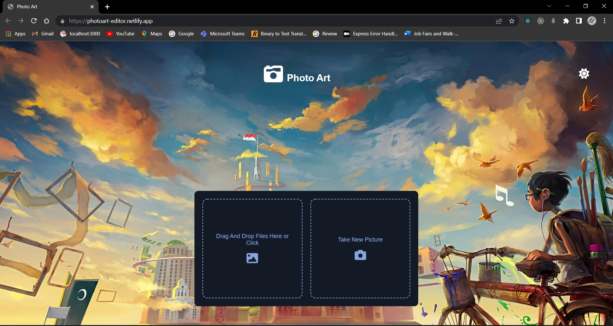

# Photo Art

**Photo Art** is a simple image editor web app [Live Demo](https://photoart-editor.netlify.app/ "Photo Art")

**Screenshots**



# How to run locally

Clone the repository and

```bash
npm start
```

`npm start`  
Runs the app in development mode.

`npm build`  
Builds production version of the app.

## Attribution

**Favicon**: [Electronics icons created by Smashicons - Flaticon](https://www.flaticon.com/free-icons/electronics)
